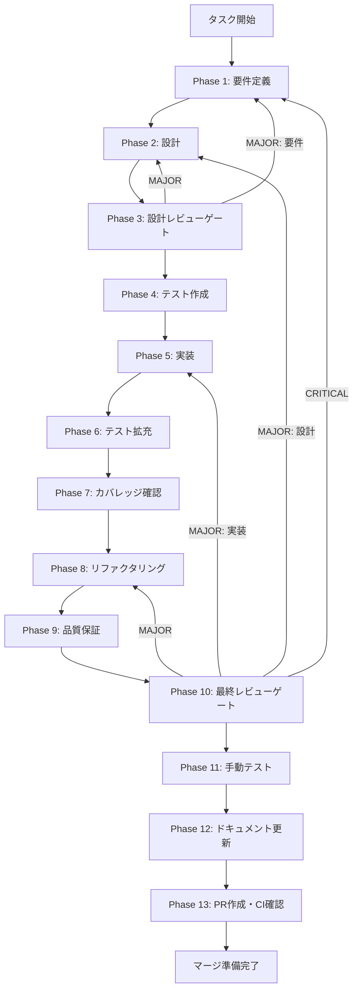

# UT-SKILL-WIZARD-FB-04-WORKFLOW-LEDGER-SYNC-001 - タスク実行仕様書

## ユーザーからの元の指示

```
Phase 12 close-out: ledger/lane index/artifacts 三者同期チェックリスト標準化
task-workflow.md / task-workflow-completed.md / lane/index.md / artifacts.json の5箇所同期が未明文化。
Phase 12完了条件テンプレートに三者同期チェックリストを追加する。
```

## メタ情報

| 項目         | 内容                                                                            |
| ------------ | ------------------------------------------------------------------------------- |
| タスクID     | UT-SKILL-WIZARD-FB-04-WORKFLOW-LEDGER-SYNC-001                                  |
| タスク名     | Phase 12 close-out ledger/lane/artifacts 三者同期チェックリスト標準化           |
| 分類         | 改善                                                                            |
| 対象機能     | task-specification-creator Phase 12 テンプレート                                |
| 優先度       | 中                                                                              |
| 見積もり規模 | 小規模                                                                          |
| タスク種別   | docs-only                                                                       |
| ステータス   | spec_created                                                                    |
| 作成日       | 2026-04-11                                                                      |
| 検出元       | UT-SKILL-WIZARD-W0-SMART-DEFAULT-REASONING-001 Phase 12 フィードバック（FB-04） |

---

## タスク概要

### 目的

`task-specification-creator` スキルの Phase 12 完了条件テンプレートに、
ledger（task-workflow.md / task-workflow-completed.md）・lane index（lane/index.md）・
artifacts（outputs/artifacts.json）の三者同期チェックリストを追加する。

### 背景

UT-SKILL-WIZARD-W0-SMART-DEFAULT-REASONING-001 の Phase 12 実行時に、
`task-workflow.md`・`task-workflow-completed.md`・`lane/index.md`・`outputs/artifacts.json`
という 4〜5 箇所のファイルを Phase 12 close-out で同時に更新する必要があることが判明した。
しかし、この同期要件が明文化されていなかったため、段階的に発見・修正が必要となった。
本タスクはこの経験を標準化し、同種の漏れを防止するための改善タスクである。

### 最終ゴール

- `task-specification-creator` スキルの Phase 12 テンプレートに「ledger/lane/artifacts三者同期」チェックリストが追加されていること
- 同期対象ファイル（backlog/completed/lane-index/artifacts）が明示されていること
- チェックリストが Phase 12 の必須完了条件として組み込まれていること

### 成果物一覧

| 種別         | 成果物                              | 配置先                                                                                      |
| ------------ | ----------------------------------- | ------------------------------------------------------------------------------------------- |
| テンプレート | Phase 12 三者同期チェックリスト追記 | `.claude/skills/task-specification-creator/assets/phase12-task-spec-compliance-template.md` |
| テンプレート | Phase 12 ガイド更新                 | `.claude/skills/task-specification-creator/references/phase-12-documentation-guide.md`      |
| テンプレート | SKILL.md よくある漏れテーブル更新   | `.claude/skills/task-specification-creator/SKILL.md`                                        |
| ドキュメント | 実装ガイド                          | `outputs/phase-12/implementation-guide.md`                                                  |
| ドキュメント | システム仕様更新サマリー            | `outputs/phase-12/system-spec-update-summary.md`                                            |
| ドキュメント | ドキュメント変更履歴                | `outputs/phase-12/documentation-changelog.md`                                               |
| ドキュメント | 未タスク検出レポート                | `outputs/phase-12/unassigned-task-detection.md`                                             |
| ドキュメント | スキルフィードバックレポート        | `outputs/phase-12/skill-feedback-report.md`                                                 |

---

## 参照ファイル

- `.claude/skills/task-specification-creator/SKILL.md` - Phase 12 よくある漏れテーブル
- `.claude/skills/task-specification-creator/assets/phase12-task-spec-compliance-template.md` - Phase 12 準拠テンプレート
- `.claude/skills/task-specification-creator/references/phase-12-documentation-guide.md` - Phase 12 ガイド
- `.claude/skills/task-specification-creator/references/spec-update-workflow.md` - システム仕様更新ワークフロー

---

## タスク分解サマリー

| ID     | フェーズ | サブタスク名             | 責務                                 | 依存 |
| ------ | -------- | ------------------------ | ------------------------------------ | ---- |
| T-01-1 | Phase 1  | 要件定義・影響範囲確定   | 変更対象テンプレート特定・AC定義     | -    |
| T-02-1 | Phase 2  | チェックリスト設計       | 三者同期チェックリスト内容設計       | T-01 |
| T-03-1 | Phase 3  | 設計レビューゲート       | 設計の矛盾・漏れチェック             | T-02 |
| T-04-1 | Phase 4  | テスト作成               | 検証手順・expected resultの定義      | T-03 |
| T-05-1 | Phase 5  | テンプレート更新実装     | 対象ファイルへのチェックリスト追記   | T-04 |
| T-06-1 | Phase 6  | テスト拡充               | エッジケース・回帰テスト追加         | T-05 |
| T-07-1 | Phase 7  | カバレッジ確認           | 変更箇所の完全性検証                 | T-06 |
| T-08-1 | Phase 8  | リファクタリング         | チェックリスト文言最適化             | T-07 |
| T-09-1 | Phase 9  | 品質保証                 | 静的検証・整合性確認                 | T-08 |
| T-10-1 | Phase 10 | 最終レビューゲート       | AC充足・ブロッカー判定               | T-09 |
| T-11-1 | Phase 11 | 手動テスト（NON_VISUAL） | テンプレート変更の動作確認           | T-10 |
| T-12-1 | Phase 12 | ドキュメント更新         | 実装ガイド・仕様同期・フィードバック | T-11 |
| T-13-1 | Phase 13 | PR作成                   | ユーザー承認後PR提出                 | T-12 |

**総サブタスク数**: 13個

---

## 実行フロー図



---

## Phase一覧

| Phase | 名称               | 仕様書                                                       | ステータス                  |
| ----- | ------------------ | ------------------------------------------------------------ | --------------------------- |
| 1     | 要件定義           | [phase-1-requirements.md](phase-1-requirements.md)           | spec_created                |
| 2     | 設計               | [phase-2-design.md](phase-2-design.md)                       | spec_created                |
| 3     | 設計レビューゲート | [phase-3-design-review.md](phase-3-design-review.md)         | spec_created                |
| 4     | テスト作成         | [phase-4-test-creation.md](phase-4-test-creation.md)         | spec_created                |
| 5     | 実装               | [phase-5-implementation.md](phase-5-implementation.md)       | spec_created                |
| 6     | テスト拡充         | [phase-6-test-expansion.md](phase-6-test-expansion.md)       | spec_created                |
| 7     | カバレッジ確認     | [phase-7-coverage-check.md](phase-7-coverage-check.md)       | spec_created                |
| 8     | リファクタリング   | [phase-8-refactoring.md](phase-8-refactoring.md)             | spec_created                |
| 9     | 品質保証           | [phase-9-quality-assurance.md](phase-9-quality-assurance.md) | spec_created                |
| 10    | 最終レビューゲート | [phase-10-final-review.md](phase-10-final-review.md)         | spec_created                |
| 11    | 手動テスト         | [phase-11-manual-test.md](phase-11-manual-test.md)           | spec_created                |
| 12    | ドキュメント更新   | [phase-12-documentation.md](phase-12-documentation.md)       | spec_created                |
| 13    | PR作成             | [phase-13-pr-creation.md](phase-13-pr-creation.md)           | ユーザー指示待ち（blocked） |

---

## テストカバレッジ目標

> docs-only タスクのため、テスト対象は「テンプレートの構造的整合性」と「チェックリスト項目の完全性」。

| 指標                      | 目標 |
| ------------------------- | ---- |
| チェックリスト項目網羅率  | 100% |
| 対象ファイル更新完了率    | 100% |
| SKILL.md よくある漏れ反映 | 100% |

---

## Phase完了時の必須アクション

**各Phase完了時に以下を必ず実行すること:**

1. **タスク100%実行**: Phase内で指定された全タスクを完全に実行
2. **成果物確認**: 全ての必須成果物が生成されていることを検証
3. **実行記録**: 実行タスクの結果を記録
4. **artifacts.json更新**: Phase完了ステータスを更新
5. **Phase末端の実行確認**: 各タスクを100%実行し、各タスクを完遂した旨を必ず明記

```bash
# Phase完了時の検証コマンド
node .claude/skills/task-specification-creator/scripts/validate-phase-output.js docs/30-workflows/ut-skill-wizard-fb04-workflow-ledger-sync --phase <N>
```
