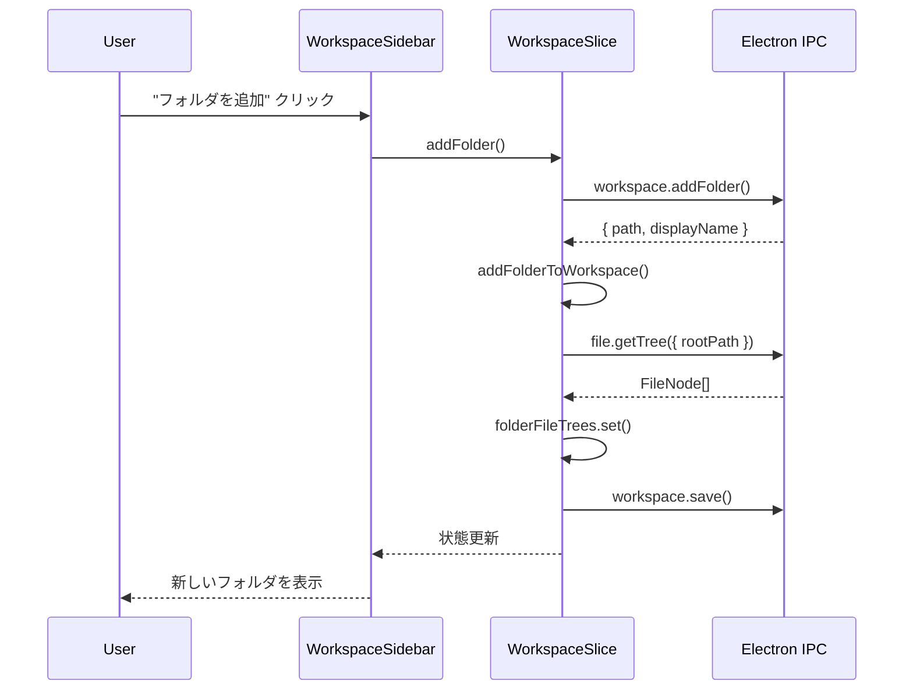
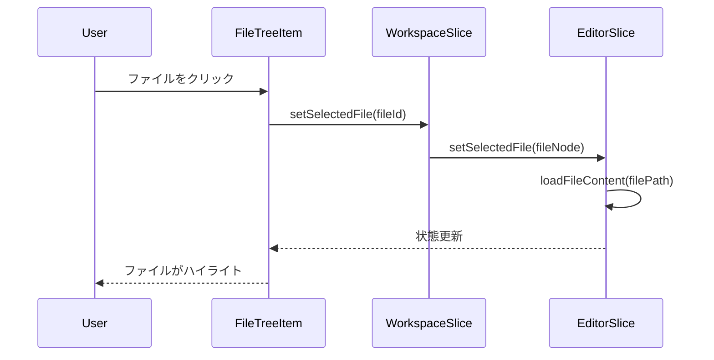

# ワークスペースマネージャー - UI設計書

## メタ情報

| 項目           | 内容                  |
| -------------- | --------------------- |
| ドキュメントID | UI-WS-001             |
| バージョン     | 1.0.0                 |
| 作成日         | 2025-12-11            |
| 作成者         | @ui-designer          |
| ステータス     | ドラフト              |
| レビュー状態   | 未レビュー            |
| 関連文書       | DM-WS-001, IPC-WS-001 |

---

## 1. 概要

### 1.1 目的

ワークスペースマネージャー機能のUIコンポーネントを設計する。
既存のSidebarコンポーネントを拡張し、複数フォルダ対応のワークスペースサイドバーを実現する。

### 1.2 設計原則

- **Atomic Design**: 既存のatoms/molecules/organismsパターンに従う
- **Composition Pattern**: 柔軟で再利用可能なコンポーネント構造
- **WCAG 2.1 AA準拠**: アクセシビリティを最優先
- **TypeScript strict**: 型安全性の確保
- **Tailwind CSS**: 既存のスタイリングパターンに準拠

### 1.3 コンポーネント階層図

```
WorkspaceSidebar (organism)
├── WorkspaceHeader (molecule)
│   ├── Title
│   └── AddFolderButton (atom)
├── FolderEntryList
│   └── FolderEntry (molecule) × N
│       ├── FolderEntryHeader
│       │   ├── FolderIcon
│       │   ├── FolderName
│       │   ├── ExpandToggle
│       │   └── RemoveButton
│       └── FileTree (既存Sidebar内部ロジック流用)
│           └── FileTreeItem (既存molecule) × N
└── EmptyState (atom, 既存)
```

---

## 2. UIモックアップ

### 2.1 通常状態

```
┌─────────────────────────────────┐
│ Workspace              [+ Add] │  ← WorkspaceHeader
├─────────────────────────────────┤
│ ▼ 📁 my-project                │  ← FolderEntry (展開)
│   ├─ 📁 src                    │
│   │  ├─ 📄 index.ts           │
│   │  └─ 📄 App.tsx ●          │  ← 未保存インジケーター
│   ├─ 📄 package.json          │
│   └─ 📄 README.md             │
│                                 │
│ ▶ 📁 shared-lib                │  ← FolderEntry (折りたたみ)
│                                 │
│ ▶ 📁 docs                      │  ← FolderEntry (折りたたみ)
│                                 │
└─────────────────────────────────┘
```

### 2.2 空状態

```
┌─────────────────────────────────┐
│ Workspace              [+ Add] │
├─────────────────────────────────┤
│                                 │
│     📁                         │
│                                 │
│  フォルダがありません            │
│                                 │
│  [フォルダを追加]               │
│                                 │
└─────────────────────────────────┘
```

### 2.3 コンテキストメニュー

```
┌─────────────────────────────────┐
│ ▼ 📁 my-project    [右クリック] │
│   ├─ 📁 src        ┌──────────────────┐
│   │  └─ ...       │ 📂 フォルダを開く │
│                    │ ─────────────── │
│                    │ 🗑 削除          │
│                    └──────────────────┘
```

---

## 3. コンポーネント設計

### 3.1 WorkspaceSidebar (Organism)

#### Props定義

```typescript
export interface WorkspaceSidebarProps {
  /** ワークスペース状態 */
  workspace: Workspace;

  /** 選択中のファイル */
  selectedFile: FileNode | null;

  /** 未保存ファイルのパス一覧 */
  unsavedFiles: Set<string>;

  /** フォルダ追加ハンドラー */
  onAddFolder: () => Promise<void>;

  /** フォルダ削除ハンドラー */
  onRemoveFolder: (folderId: FolderId) => void;

  /** フォルダ展開/折りたたみハンドラー */
  onToggleFolderExpansion: (folderId: FolderId) => void;

  /** サブフォルダ展開/折りたたみハンドラー */
  onToggleSubfolder: (folderId: FolderId, subfolderPath: string) => void;

  /** ファイル選択ハンドラー */
  onSelectFile: (file: FileNode) => void;

  /** ローディング状態 */
  isLoading?: boolean;

  /** エラー状態 */
  error?: string | null;

  /** カスタムクラス */
  className?: string;
}
```

#### 実装雛形

```tsx
export const WorkspaceSidebar: React.FC<WorkspaceSidebarProps> = ({
  workspace,
  selectedFile,
  unsavedFiles,
  onAddFolder,
  onRemoveFolder,
  onToggleFolderExpansion,
  onToggleSubfolder,
  onSelectFile,
  isLoading = false,
  error = null,
  className,
}) => {
  const isEmpty = workspace.folders.length === 0;

  return (
    <aside
      className={clsx("w-[280px] bg-transparent p-4 flex flex-col", className)}
      role="complementary"
      aria-label="ワークスペースエクスプローラー"
    >
      {/* ヘッダー */}
      <WorkspaceHeader onAddFolder={onAddFolder} isLoading={isLoading} />

      {/* エラー表示 */}
      {error && <ErrorDisplay message={error} className="mb-4" />}

      {/* コンテンツ */}
      <div className="flex-1 overflow-y-auto">
        {isLoading ? (
          <LoadingDisplay message="読み込み中..." />
        ) : isEmpty ? (
          <WorkspaceEmptyState onAddFolder={onAddFolder} />
        ) : (
          <FolderEntryList
            folders={workspace.folders}
            selectedFile={selectedFile}
            unsavedFiles={unsavedFiles}
            onRemoveFolder={onRemoveFolder}
            onToggleFolderExpansion={onToggleFolderExpansion}
            onToggleSubfolder={onToggleSubfolder}
            onSelectFile={onSelectFile}
          />
        )}
      </div>
    </aside>
  );
};
```

---

### 3.2 WorkspaceHeader (Molecule)

#### Props定義

```typescript
export interface WorkspaceHeaderProps {
  /** フォルダ追加ハンドラー */
  onAddFolder: () => Promise<void>;

  /** ローディング状態 */
  isLoading?: boolean;
}
```

#### 実装雛形

```tsx
export const WorkspaceHeader: React.FC<WorkspaceHeaderProps> = ({
  onAddFolder,
  isLoading = false,
}) => {
  const [isAdding, setIsAdding] = React.useState(false);

  const handleAddClick = async () => {
    setIsAdding(true);
    try {
      await onAddFolder();
    } finally {
      setIsAdding(false);
    }
  };

  return (
    <div className="flex items-center justify-between mb-4">
      <h2 className="text-lg font-semibold text-white">Workspace</h2>
      <Button
        variant="ghost"
        size="sm"
        onClick={handleAddClick}
        disabled={isLoading || isAdding}
        aria-label="フォルダを追加"
      >
        {isAdding ? <Spinner size={16} /> : <Icon name="plus" size={16} />}
      </Button>
    </div>
  );
};
```

---

### 3.3 FolderEntry (Molecule)

#### Props定義

```typescript
export interface FolderEntryProps {
  /** フォルダエントリーデータ */
  entry: FolderEntry;

  /** ファイルツリーデータ */
  fileTree: FileNode[];

  /** 選択中のファイル */
  selectedFile: FileNode | null;

  /** 未保存ファイルのパス一覧 */
  unsavedFiles: Set<string>;

  /** 削除ハンドラー */
  onRemove: () => void;

  /** 展開/折りたたみハンドラー */
  onToggleExpansion: () => void;

  /** サブフォルダ展開/折りたたみハンドラー */
  onToggleSubfolder: (subfolderPath: string) => void;

  /** ファイル選択ハンドラー */
  onSelectFile: (file: FileNode) => void;
}
```

#### 実装雛形

```tsx
export const FolderEntry: React.FC<FolderEntryProps> = ({
  entry,
  fileTree,
  selectedFile,
  unsavedFiles,
  onRemove,
  onToggleExpansion,
  onToggleSubfolder,
  onSelectFile,
}) => {
  const [showContextMenu, setShowContextMenu] = React.useState(false);
  const [contextMenuPosition, setContextMenuPosition] = React.useState({
    x: 0,
    y: 0,
  });

  const handleContextMenu = (e: React.MouseEvent) => {
    e.preventDefault();
    setContextMenuPosition({ x: e.clientX, y: e.clientY });
    setShowContextMenu(true);
  };

  const handleKeyDown = (e: React.KeyboardEvent) => {
    switch (e.key) {
      case "Enter":
      case " ":
        e.preventDefault();
        onToggleExpansion();
        break;
      case "Delete":
      case "Backspace":
        if (e.metaKey || e.ctrlKey) {
          e.preventDefault();
          onRemove();
        }
        break;
      case "ArrowRight":
        if (!entry.isExpanded) {
          e.preventDefault();
          onToggleExpansion();
        }
        break;
      case "ArrowLeft":
        if (entry.isExpanded) {
          e.preventDefault();
          onToggleExpansion();
        }
        break;
    }
  };

  return (
    <div
      className="mb-2"
      role="treeitem"
      aria-expanded={entry.isExpanded}
      aria-label={entry.displayName}
    >
      {/* フォルダヘッダー */}
      <div
        className={clsx(
          "flex items-center gap-2 px-3 py-2 cursor-pointer rounded-md",
          "hover:bg-white/5 transition-colors group",
        )}
        onClick={onToggleExpansion}
        onContextMenu={handleContextMenu}
        onKeyDown={handleKeyDown}
        tabIndex={0}
      >
        {/* 展開アイコン */}
        <Icon
          name={entry.isExpanded ? "chevron-down" : "chevron-right"}
          size={12}
          className="text-gray-400 flex-shrink-0"
        />

        {/* フォルダアイコン */}
        <Icon
          name={entry.isExpanded ? "folder-open" : "folder"}
          size={16}
          className="text-blue-400 flex-shrink-0"
        />

        {/* フォルダ名 */}
        <span className="flex-1 text-sm font-medium text-white truncate">
          {entry.displayName}
        </span>

        {/* 削除ボタン（ホバー時のみ表示） */}
        <button
          className={clsx(
            "opacity-0 group-hover:opacity-100 transition-opacity",
            "p-1 rounded hover:bg-white/10",
          )}
          onClick={(e) => {
            e.stopPropagation();
            onRemove();
          }}
          aria-label={`${entry.displayName} を削除`}
        >
          <Icon name="x" size={12} className="text-gray-400" />
        </button>
      </div>

      {/* ファイルツリー */}
      {entry.isExpanded && fileTree.length > 0 && (
        <div
          role="group"
          aria-label={`${entry.displayName} の内容`}
          className="ml-4"
        >
          {renderFileTree(
            fileTree,
            entry,
            selectedFile,
            unsavedFiles,
            onToggleSubfolder,
            onSelectFile,
          )}
        </div>
      )}

      {/* コンテキストメニュー */}
      {showContextMenu && (
        <ContextMenu
          position={contextMenuPosition}
          onClose={() => setShowContextMenu(false)}
          items={[
            {
              label: "フォルダを開く",
              icon: "folder-open",
              onClick: () => {
                // システムでフォルダを開く
              },
            },
            { type: "separator" },
            {
              label: "削除",
              icon: "trash",
              onClick: onRemove,
              variant: "danger",
            },
          ]}
        />
      )}
    </div>
  );
};
```

---

### 3.4 WorkspaceEmptyState (Molecule)

```tsx
export interface WorkspaceEmptyStateProps {
  onAddFolder: () => Promise<void>;
}

export const WorkspaceEmptyState: React.FC<WorkspaceEmptyStateProps> = ({
  onAddFolder,
}) => {
  return (
    <div className="flex flex-col items-center justify-center py-12 text-center">
      <Icon name="folder" size={48} className="text-gray-500 mb-4" />
      <p className="text-sm text-gray-400 mb-4">フォルダがありません</p>
      <Button
        variant="outline"
        size="sm"
        onClick={onAddFolder}
        aria-label="フォルダを追加"
      >
        <Icon name="plus" size={16} className="mr-2" />
        フォルダを追加
      </Button>
    </div>
  );
};
```

---

## 4. 状態管理（Zustand Slice）

### 4.1 WorkspaceSlice定義

```typescript
import { StateCreator } from "zustand";
import type {
  Workspace,
  FolderId,
  FileId,
  FolderEntry,
  PersistedWorkspaceState,
} from "@/types/workspace";

export interface WorkspaceSlice {
  // State
  workspace: Workspace;
  folderFileTrees: Map<FolderId, FileNode[]>;
  isLoading: boolean;
  error: string | null;

  // Actions
  loadWorkspace: () => Promise<void>;
  saveWorkspace: () => Promise<void>;
  addFolder: () => Promise<void>;
  removeFolder: (folderId: FolderId) => void;
  toggleFolderExpansion: (folderId: FolderId) => void;
  toggleSubfolder: (folderId: FolderId, subfolderPath: string) => void;
  setSelectedFile: (fileId: FileId | null) => void;
  loadFolderTree: (folderId: FolderId, folderPath: string) => Promise<void>;
}

export const createWorkspaceSlice: StateCreator<
  WorkspaceSlice,
  [],
  [],
  WorkspaceSlice
> = (set, get) => ({
  // Initial state
  workspace: createWorkspace(),
  folderFileTrees: new Map(),
  isLoading: false,
  error: null,

  // Actions
  loadWorkspace: async () => {
    set({ isLoading: true, error: null });
    try {
      const response = await window.electronAPI.workspace.load();
      if (response.success && response.data) {
        const { workspace, warnings } = deserializeWorkspace(response.data);

        // 無効なパスの警告を表示
        if (warnings.length > 0) {
          console.warn("Workspace load warnings:", warnings);
        }

        // パス検証
        const paths = workspace.folders.map((f) => f.path);
        const validation = await window.electronAPI.workspace.validatePaths({
          paths,
        });
        if (validation.success && validation.data) {
          // 無効なパスを除外
          const validPaths = new Set(validation.data.validPaths);
          const filteredFolders = workspace.folders.filter((f) =>
            validPaths.has(f.path),
          );
          workspace.folders = filteredFolders;

          // 無効なパスがあれば通知
          if (validation.data.invalidPaths.length > 0) {
            // トースト通知などで表示
          }
        }

        set({ workspace, isLoading: false });

        // 各フォルダのファイルツリーを読み込み
        for (const folder of workspace.folders) {
          get().loadFolderTree(folder.id, folder.path);
        }
      } else {
        set({ isLoading: false });
      }
    } catch (error) {
      set({
        error: error instanceof Error ? error.message : "Unknown error",
        isLoading: false,
      });
    }
  },

  saveWorkspace: async () => {
    const { workspace } = get();
    const state = serializeWorkspace(workspace);
    await window.electronAPI.workspace.save({ state });
  },

  addFolder: async () => {
    const response = await window.electronAPI.workspace.addFolder();
    if (response.success && response.data) {
      const { workspace } = get();
      try {
        const folderPath = createFolderPath(response.data.path);
        const newWorkspace = addFolderToWorkspace(workspace, folderPath);
        set({ workspace: newWorkspace });

        // ファイルツリーを読み込み
        const newFolder = newWorkspace.folders[newWorkspace.folders.length - 1];
        get().loadFolderTree(newFolder.id, newFolder.path);

        // 永続化
        get().saveWorkspace();
      } catch (error) {
        if (error instanceof DuplicateFolderError) {
          // トースト通知: "このフォルダは既に追加されています"
        }
      }
    }
  },

  removeFolder: (folderId: FolderId) => {
    const { workspace, folderFileTrees } = get();
    try {
      const newWorkspace = removeFolderFromWorkspace(workspace, folderId);
      const newFileTrees = new Map(folderFileTrees);
      newFileTrees.delete(folderId);

      set({ workspace: newWorkspace, folderFileTrees: newFileTrees });
      get().saveWorkspace();
    } catch (error) {
      console.error("Failed to remove folder:", error);
    }
  },

  toggleFolderExpansion: (folderId: FolderId) => {
    const { workspace } = get();
    const folder = workspace.folders.find((f) => f.id === folderId);
    if (folder) {
      const newWorkspace = updateFolderExpansion(
        workspace,
        folderId,
        !folder.isExpanded,
      );
      set({ workspace: newWorkspace });
      get().saveWorkspace();
    }
  },

  toggleSubfolder: (folderId: FolderId, subfolderPath: string) => {
    const { workspace } = get();
    const folder = workspace.folders.find((f) => f.id === folderId);
    if (folder) {
      const newExpandedPaths = new Set(folder.expandedPaths);
      if (newExpandedPaths.has(subfolderPath)) {
        newExpandedPaths.delete(subfolderPath);
      } else {
        newExpandedPaths.add(subfolderPath);
      }
      set({
        workspace: {
          ...workspace,
          folders: workspace.folders.map((f) =>
            f.id === folderId ? { ...f, expandedPaths: newExpandedPaths } : f,
          ),
        },
      });
      get().saveWorkspace();
    }
  },

  setSelectedFile: (fileId: FileId | null) => {
    const { workspace } = get();
    const newWorkspace = setLastSelectedFile(workspace, fileId);
    set({ workspace: newWorkspace });
    get().saveWorkspace();
  },

  loadFolderTree: async (folderId: FolderId, folderPath: string) => {
    try {
      const response = await window.electronAPI.file.getTree({
        rootPath: folderPath,
        depth: 10,
      });
      if (response.success && response.data) {
        const { folderFileTrees } = get();
        const newFileTrees = new Map(folderFileTrees);
        newFileTrees.set(folderId, response.data);
        set({ folderFileTrees: newFileTrees });
      }
    } catch (error) {
      console.error(`Failed to load file tree for ${folderPath}:`, error);
    }
  },
});
```

---

## 5. アクセシビリティ設計

### 5.1 WAI-ARIAパターン

| 要素             | role          | aria-\* 属性                                |
| ---------------- | ------------- | ------------------------------------------- |
| WorkspaceSidebar | complementary | aria-label="ワークスペースエクスプローラー" |
| FolderEntryList  | tree          | aria-label="フォルダ一覧"                   |
| FolderEntry      | treeitem      | aria-expanded, aria-label                   |
| FileTree (group) | group         | aria-label="{フォルダ名} の内容"            |
| FileTreeItem     | treeitem      | aria-selected, aria-expanded                |
| AddFolderButton  | button        | aria-label="フォルダを追加"                 |
| RemoveButton     | button        | aria-label="{フォルダ名} を削除"            |

### 5.2 キーボードナビゲーション

| キー             | 動作                                 |
| ---------------- | ------------------------------------ |
| Tab              | フォーカス移動                       |
| Enter / Space    | 展開/折りたたみ、ファイル選択        |
| ArrowUp          | 前のアイテムにフォーカス             |
| ArrowDown        | 次のアイテムにフォーカス             |
| ArrowRight       | フォルダを展開                       |
| ArrowLeft        | フォルダを折りたたみ                 |
| Delete (Cmd+Del) | フォルダを削除（確認ダイアログ付き） |
| Escape           | コンテキストメニューを閉じる         |

### 5.3 フォーカス管理

```typescript
// キーボードナビゲーション用のカスタムフック
export function useTreeNavigation(items: string[]) {
  const [focusedIndex, setFocusedIndex] = React.useState(0);
  const itemRefs = React.useRef<Map<string, HTMLElement>>(new Map());

  const handleKeyDown = (e: React.KeyboardEvent) => {
    switch (e.key) {
      case "ArrowDown":
        e.preventDefault();
        setFocusedIndex((i) => Math.min(i + 1, items.length - 1));
        break;
      case "ArrowUp":
        e.preventDefault();
        setFocusedIndex((i) => Math.max(i - 1, 0));
        break;
      case "Home":
        e.preventDefault();
        setFocusedIndex(0);
        break;
      case "End":
        e.preventDefault();
        setFocusedIndex(items.length - 1);
        break;
    }
  };

  React.useEffect(() => {
    const item = items[focusedIndex];
    const element = itemRefs.current.get(item);
    element?.focus();
  }, [focusedIndex, items]);

  return { focusedIndex, handleKeyDown, itemRefs };
}
```

---

## 6. インタラクションフロー

### 6.1 フォルダ追加フロー



### 6.2 ファイル選択フロー



---

## 7. ファイル構成

### 7.1 新規作成ファイル

```
apps/desktop/src/renderer/
├── components/
│   ├── molecules/
│   │   └── FolderEntry/
│   │       ├── index.tsx
│   │       └── FolderEntry.test.tsx
│   └── organisms/
│       └── WorkspaceSidebar/
│           ├── index.tsx
│           ├── WorkspaceSidebar.test.tsx
│           ├── WorkspaceHeader.tsx
│           └── WorkspaceEmptyState.tsx
├── hooks/
│   └── useTreeNavigation.ts
└── store/
    └── slices/
        └── workspaceSlice.ts
```

### 7.2 既存ファイルの変更

| ファイル                        | 変更内容                     |
| ------------------------------- | ---------------------------- |
| `store/index.ts`                | workspaceSliceの追加         |
| `store/types.ts`                | WorkspaceSlice型の追加       |
| `components/organisms/index.ts` | WorkspaceSidebarのexport追加 |
| EditorViewコンポーネント        | WorkspaceSidebarとの統合     |

---

## 8. 品質基準

### 8.1 完了条件

- [ ] WorkspaceSidebarがorganismsに配置されている
- [ ] 型定義が完全で安全（TypeScript strict mode）
- [ ] WCAG 2.1 AA基準を満たしている
- [ ] キーボードナビゲーションが実装されている
- [ ] テストカバレッジ80%以上
- [ ] 既存のSidebarと一貫したスタイリング

### 8.2 品質メトリクス

| メトリクス             | 目標    |
| ---------------------- | ------- |
| アクセシビリティスコア | 100%    |
| テストカバレッジ       | 80%以上 |
| TypeScript strict      | 100%    |
| Tailwindクラス使用率   | 90%以上 |

---

## 9. 次フェーズへの引き継ぎ

### 9.1 T-02 (設計レビュー) への入力

- コンポーネント設計書
- 状態管理設計（WorkspaceSlice）
- アクセシビリティ要件

### 9.2 T-03 (TDD実装) への入力

- コンポーネントAPI定義
- テストケースの観点
- モックデータ構造

### 9.3 実装時の注意点

1. 既存のSidebarコンポーネントとの互換性を維持
2. FileTreeItemは既存コンポーネントを再利用
3. コンテキストメニューは必要に応じて別途実装
4. トースト通知は既存の通知システムを使用

---

## 変更履歴

| バージョン | 日付       | 変更者       | 変更内容                                 |
| ---------- | ---------- | ------------ | ---------------------------------------- |
| 1.0.0      | 2025-12-11 | @ui-designer | 初版作成（コンポーネント設計、状態管理） |
