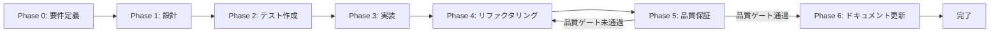

# タスク実行仕様書生成ガイド

> 本ドキュメントは統合システム設計仕様書の一部です。
> 管理: .claude/skills/aiworkflow-requirements/

---

## 概要

本ドキュメントは、複雑なタスクを単一責務の原則に基づいて分解し、各サブタスクに最適なスラッシュコマンド・エージェント・スキルの組み合わせを選定するためのガイドラインを定義する。

### 目的

ユーザーから与えられた複雑なタスクを分解し、以下を実現する：

- 単一責務の原則に基づいたサブタスク分割
- 各サブタスクに最適なコマンド・エージェント・スキルの選定
- そのまま実行可能な仕様書ドキュメントの生成
- TDDサイクル（Red→Green→Refactor）の組み込み
- 品質ゲートの明確化

### 成果物配置

生成された仕様書は以下のパスに配置する：

```
docs/30-workflows/{{機能名}}/task-step{{N}}-{{機能名}}.md
```

---

## ドキュメント構成

| ドキュメント     | ファイル                                             | 説明                                           |
| ---------------- | ---------------------------------------------------- | ---------------------------------------------- |
| フェーズ定義     | [task-workflow-phases.md](./task-workflow-phases.md) | Phase 0〜6の詳細定義とテンプレート             |
| ルール・選定基準 | [task-workflow-rules.md](./task-workflow-rules.md)   | 品質ゲート、コマンド・エージェント・スキル選定 |

---

## フェーズ構造（概要）

すべてのタスクは以下のフェーズ構造に従う。詳細は [task-workflow-phases.md](./task-workflow-phases.md) を参照。

| フェーズ                                  | ID接頭辞 | 目的                                         |
| ----------------------------------------- | -------- | -------------------------------------------- |
| Phase 0: 要件定義                         | `T-00`   | タスクの目的、スコープ、受け入れ基準を明文化 |
| Phase 1: 設計                             | `T-01`   | 要件を実現可能な構造に落とし込む             |
| Phase 2: テスト作成 (TDD: Red)            | `T-02`   | 期待される動作を検証するテストを先行作成     |
| Phase 3: 実装 (TDD: Green)                | `T-03`   | テストを通すための最小限の実装               |
| Phase 4: リファクタリング (TDD: Refactor) | `T-04`   | 動作を変えずにコード品質を改善               |
| Phase 5: 品質保証                         | `T-05`   | 定義された品質基準をすべて満たすことを検証   |
| Phase 6: ドキュメント更新                 | `T-06`   | 実装内容をシステム要件ドキュメントに反映     |

### フェーズ遷移図



---

## 品質ゲート（概要）

次フェーズに進む前に満たすべき品質基準。詳細は [task-workflow-rules.md](./task-workflow-rules.md) を参照。

- 機能検証: 全テスト成功（ユニット、統合、E2E）
- コード品質: Lintエラーなし、型エラーなし、フォーマット適用済み
- テスト網羅性: カバレッジ基準達成（60%以上）
- セキュリティ: 脆弱性スキャン完了、重大な脆弱性なし

---

## 出力テンプレート

### ファイル配置

```
docs/30-workflows/{{機能名}}/task-step{{N}}-{{機能名}}.md
```

### テンプレート構造

タスク実行仕様書は以下の構造を持つ：

1. **ユーザーからの元の指示** - 元の指示文をそのまま記載
2. **タスク概要** - 目的、背景、最終ゴール、成果物一覧
3. **参照ファイル** - コマンド・エージェント・スキル選定の参照先
4. **タスク分解サマリー** - 全サブタスクの一覧表
5. **実行フロー図** - Mermaidによるフロー可視化
6. **各フェーズの詳細** - Phase 0〜5の各サブタスク詳細
7. **品質ゲートチェックリスト** - 完了条件のチェック項目
8. **リスクと対策** - リスク分析と対応方針
9. **前提条件** - タスク実行の前提
10. **備考** - 技術的制約、参考資料

---

## 実行時のコマンド・エージェント・スキル

### 本ドキュメント作成に使用するコマンド

| コマンド       | 用途                                                            |
| -------------- | --------------------------------------------------------------- |
| `/sc:workflow` | PRDと機能要件から構造化された実装ワークフローを生成             |
| `/sc:document` | コンポーネント、関数、API、機能の重点的文書生成                 |
| `/sc:design`   | システムアーキテクチャ、API、コンポーネントインターフェース設計 |

### 本ドキュメント作成に使用するエージェント

| エージェント           | 用途                                                   |
| ---------------------- | ------------------------------------------------------ |
| `technical-writer`     | 使いやすさとアクセシビリティに重点を置いた技術文書作成 |
| `requirements-analyst` | 曖昧なプロジェクトアイデアを具体的な仕様に変換         |
| `system-architect`     | スケーラブルシステムアーキテクチャ設計                 |

### 本ドキュメント作成に使用するスキル

タスク実行仕様書の生成には、プロジェクト固有のスキル定義（`.claude/skills/skill_list.md`）を参照する。

---

## 関連ドキュメント

- [プロジェクト概要](./overview.md)
- [非機能要件](./quality-requirements.md)
- [アーキテクチャ設計](./architecture-overview.md)
- [プラグイン開発手順](./plugin-development.md)
