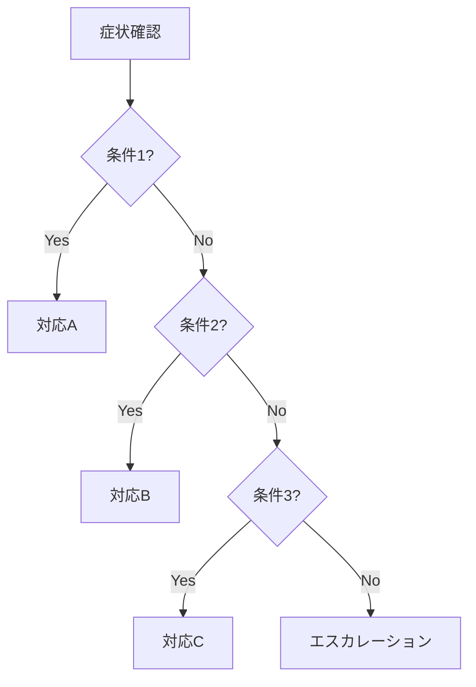

# ランブック構造パターン（Level 2）

> **読込条件**: Task 3（ランブック作成）開始時

---

## 1. ランブック構造の設計

### 1.1 標準構造

```markdown
# ランブック: {{タイトル}}

## メタデータ

## 目的

## 適用条件

## 前提条件

## 診断フロー

## 手順

## ロールバック手順

## エスカレーション

## トラブルシューティング

## 関連リンク

## 変更履歴
```

### 1.2 セクション設計原則

| 原則         | 説明                             |
| ------------ | -------------------------------- |
| 順序の論理性 | 実行順序に沿った構成             |
| 完全性       | 必要な情報が全て含まれている     |
| 独立性       | 各セクションは単独でも理解可能   |
| 参照可能性   | 必要な箇所に素早くアクセスできる |

---

## 2. 診断フローの設計

### 2.1 フローチャートパターン



### 2.2 デシジョンポイントの設計

| 設計要素         | ルール                                   |
| ---------------- | ---------------------------------------- |
| 判断基準         | 明確な数値または状態で判定可能           |
| 選択肢           | Yes/No または明確な選択肢のみ            |
| 深さ制限         | 最大5階層まで（それ以上は分割）          |
| エスカレーション | 必ず最終手段としてエスカレーションを設置 |

---

## 3. 手順セクションの設計

### 3.1 ステップ構造

`````markdown
### Step N: {{ステップタイトル}}

**目的**: {{このステップで達成すること}}

**実行コマンド**:

````bash
{{コマンド}}
\```

**期待される結果**:
{{正常時の出力例}}

**異常時の対応**:
- {{エラーパターン1}}: {{対処法1}}
- {{エラーパターン2}}: {{対処法2}}

**注意事項**:
- {{注意点}}
````
`````

````

### 3.2 コマンド記述ルール

| ルール       | 説明                             | 例                      |
| ------------ | -------------------------------- | ----------------------- |
| 変数の明示   | 環境依存部分は`{{変数名}}`で明示 | `ssh {{HOSTNAME}}`      |
| 絶対パス使用 | 相対パスではなく絶対パスを使用   | `/var/log/app.log`      |
| 実行確認済み | 記載コマンドは事前にテスト済み   | -                       |
| 出力例の記載 | 正常時の出力を例示               | `Connection successful` |

---

## 4. エスカレーション設計

### 4.1 エスカレーション基準

| レベル | 基準                           | エスカレート先   |
| ------ | ------------------------------ | ---------------- |
| L1     | 手順で解決しない場合           | 上位オペレーター |
| L2     | 30分以上解決しない場合         | 専門エンジニア   |
| L3     | ビジネス影響が拡大している場合 | 管理者、経営層   |

### 4.2 エスカレーション情報

| 情報           | 内容                                         |
| -------------- | -------------------------------------------- |
| 連絡先         | 名前、電話番号、Slack、メール                |
| 連絡方法       | 優先順位付きの連絡手段                       |
| 伝達事項       | 何を伝えるべきか（症状、対応状況、影響範囲） |
| 時間帯別連絡先 | 営業時間内/外での連絡先の違い                |

---

## 5. 情報収集の構造化

### 5.1 インシデント分析フレームワーク

| 観点              | 質問                   |
| ----------------- | ---------------------- |
| What（何が）      | 何が起きたのか？       |
| When（いつ）      | いつ発生したのか？     |
| Where（どこで）   | どのコンポーネントで？ |
| Why（なぜ）       | 根本原因は何か？       |
| How（どのように） | どのように対応したか？ |
| Who（誰が）       | 誰が対応したか？       |

### 5.2 SMEインタビュー構造

| 質問カテゴリ | 質問例                           |
| ------------ | -------------------------------- |
| 症状認識     | 障害の兆候は何か？               |
| 診断手順     | 原因を特定するためにどうするか？ |
| 復旧手順     | どのように復旧させるか？         |
| 落とし穴     | よくあるミスや注意点は？         |
| 前提条件     | 必要なアクセス権限や知識は？     |

---

## 6. ランブックタイプ別構造

### 6.1 インシデント対応ランブック

```
目的 → 適用条件 → 初期対応 → 診断フロー → 復旧手順 → 事後対応
```

### 6.2 トラブルシューティングランブック

```
症状 → 原因候補 → 診断手順 → 原因特定 → 解決手順 → 確認手順
```

### 6.3 リカバリー手順ランブック

```
目的 → 前提条件 → 復旧手順 → 検証手順 → ロールバック → 報告
```

---

## 関連リソース

- **前のレベル**: See [Level1_basics.md](Level1_basics.md)
- **次のレベル**: See [Level3_advanced.md](Level3_advanced.md)
- **パターン集**: See [runbook-patterns.md](runbook-patterns.md)
````
