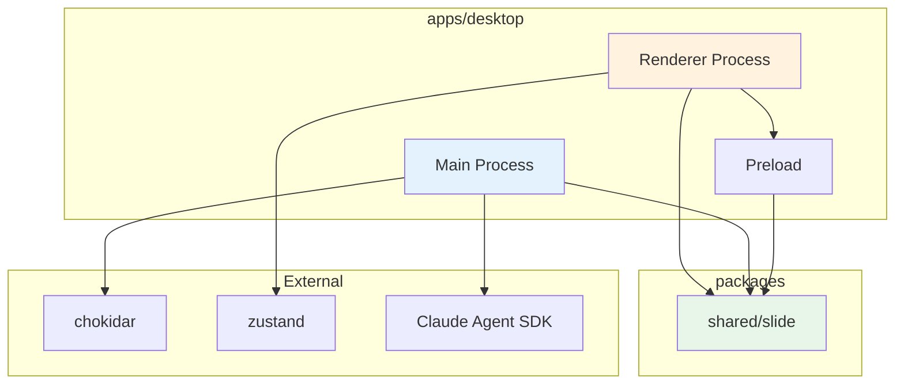

# アーキテクチャ設計書 - スライド依存関係管理システム

## 1. ドキュメント情報

| 項目       | 内容                                      |
| ---------- | ----------------------------------------- |
| タスクID   | task-feat-slide-dependency-management-003 |
| バージョン | 1.0.0                                     |
| 作成日     | 2026-01-09                                |
| 作成者     | Claude (architectural-patterns skill)     |

---

## 2. アーキテクチャ概要

### 2.1 設計原則

| 原則               | 適用方法                                   |
| ------------------ | ------------------------------------------ |
| 関心の分離         | UI、ビジネスロジック、インフラを明確に分離 |
| 単一責任原則       | 各モジュールは1つの責務のみを持つ          |
| 依存性逆転原則     | 抽象に依存し、具象に依存しない             |
| Clean Architecture | 外側から内側への一方向依存                 |

### 2.2 選定パターン

**Layered Architecture + Event-Driven Pattern**

**選定理由**:

- Electron環境のMain/Renderer分離と親和性が高い
- IPC通信による疎結合なイベント駆動が自然に実装可能
- 既存のプロジェクト構成（packages/shared, apps/desktop）と整合

---

## 3. システム全体構成

### 3.1 レイヤー構成図

```
┌─────────────────────────────────────────────────────────────────┐
│                      RENDERER PROCESS                            │
│  ┌───────────────────────────────────────────────────────────┐  │
│  │                 PRESENTATION LAYER                         │  │
│  │  ┌─────────────────┐  ┌─────────────────────────────────┐ │  │
│  │  │ SlideWorkspace  │  │ Components                      │ │  │
│  │  │ .tsx            │  │  - SkillPhasePanel.tsx          │ │  │
│  │  │                 │  │  - SyncStatusIndicator.tsx      │ │  │
│  │  │                 │  │  - ProjectSelector.tsx          │ │  │
│  │  │                 │  │  - ProgressBar.tsx              │ │  │
│  │  └─────────────────┘  └─────────────────────────────────┘ │  │
│  └───────────────────────────────────────────────────────────┘  │
│                              │                                   │
│  ┌───────────────────────────▼───────────────────────────────┐  │
│  │                 APPLICATION LAYER                          │  │
│  │  ┌─────────────────┐  ┌─────────────────────────────────┐ │  │
│  │  │ useSlideProject │  │ Hooks                           │ │  │
│  │  │ .ts             │  │  - useSkillExecution.ts         │ │  │
│  │  │                 │  │  - useSyncStatus.ts             │ │  │
│  │  │                 │  │  - useFileWatcher.ts            │ │  │
│  │  └─────────────────┘  └─────────────────────────────────┘ │  │
│  └───────────────────────────────────────────────────────────┘  │
│                              │                                   │
│  ┌───────────────────────────▼───────────────────────────────┐  │
│  │                 STATE LAYER (Zustand)                      │  │
│  │  ┌─────────────────────────────────────────────────────┐  │  │
│  │  │              slideProjectStore.ts                    │  │  │
│  │  │  - projectPath, syncStatus, currentPhase            │  │  │
│  │  │  - isWatching, executionProgress                    │  │  │
│  │  └─────────────────────────────────────────────────────┘  │  │
│  └───────────────────────────────────────────────────────────┘  │
│                              │                                   │
│  ┌───────────────────────────▼───────────────────────────────┐  │
│  │                 IPC BRIDGE LAYER                           │  │
│  │  ┌─────────────────────────────────────────────────────┐  │  │
│  │  │              slideApi (preload.ts)                   │  │  │
│  │  │  - executePhase(), startWatching(), stopWatching()  │  │  │
│  │  │  - getSyncStatus(), manualSync()                    │  │  │
│  │  │  - Event listeners                                  │  │  │
│  │  └─────────────────────────────────────────────────────┘  │  │
│  └───────────────────────────────────────────────────────────┘  │
└────────────────────────────────┬────────────────────────────────┘
                                 │ IPC (contextBridge)
┌────────────────────────────────▼────────────────────────────────┐
│                       MAIN PROCESS                               │
│  ┌───────────────────────────────────────────────────────────┐  │
│  │                 IPC HANDLER LAYER                          │  │
│  │  ┌─────────────────────────────────────────────────────┐  │  │
│  │  │              slideIpcHandlers.ts                     │  │  │
│  │  │  - registerSlideHandlers()                          │  │  │
│  │  │  - Parameter validation                             │  │  │
│  │  └─────────────────────────────────────────────────────┘  │  │
│  └───────────────────────────────────────────────────────────┘  │
│                              │                                   │
│  ┌───────────────────────────▼───────────────────────────────┐  │
│  │                 SERVICE LAYER                              │  │
│  │  ┌─────────────┐  ┌─────────────┐  ┌─────────────────┐   │  │
│  │  │ FileWatcher │  │ Skill       │  │ SyncManager     │   │  │
│  │  │ Service     │  │ Executor    │  │                 │   │  │
│  │  │             │  │             │  │                 │   │  │
│  │  └──────┬──────┘  └──────┬──────┘  └────────┬────────┘   │  │
│  │         │                │                   │            │  │
│  └─────────┼────────────────┼───────────────────┼────────────┘  │
│            │                │                   │                │
│  ┌─────────▼────────────────▼───────────────────▼────────────┐  │
│  │                 INFRASTRUCTURE LAYER                       │  │
│  │  ┌─────────────┐  ┌─────────────┐  ┌─────────────────┐   │  │
│  │  │ chokidar    │  │ Claude      │  │ File System     │   │  │
│  │  │ Adapter     │  │ Agent SDK   │  │ Adapter         │   │  │
│  │  │             │  │ Adapter     │  │                 │   │  │
│  │  └─────────────┘  └─────────────┘  └─────────────────┘   │  │
│  └───────────────────────────────────────────────────────────┘  │
└─────────────────────────────────────────────────────────────────┘
                                 │
┌────────────────────────────────▼────────────────────────────────┐
│                       SHARED PACKAGE                             │
│  ┌───────────────────────────────────────────────────────────┐  │
│  │                 DOMAIN LAYER                               │  │
│  │  ┌─────────────┐  ┌─────────────┐  ┌─────────────────┐   │  │
│  │  │ types.ts    │  │ slide-      │  │ dependency-     │   │  │
│  │  │             │  │ project.ts  │  │ manager.ts      │   │  │
│  │  │             │  │             │  │                 │   │  │
│  │  └─────────────┘  └─────────────┘  └─────────────────┘   │  │
│  └───────────────────────────────────────────────────────────┘  │
└─────────────────────────────────────────────────────────────────┘
```

### 3.2 パッケージ構成

```
packages/
└── shared/
    └── src/
        └── slide/
            ├── types.ts              # 型定義（SlideProject, SyncStatus等）
            ├── slide-project.ts      # SlideProjectドメインロジック
            ├── dependency-manager.ts # 依存関係管理ロジック
            └── index.ts              # エクスポート

apps/
└── desktop/
    └── src/
        ├── main/
        │   └── slide/
        │       ├── file-watcher.ts      # ファイル監視サービス
        │       ├── skill-executor.ts    # スキル実行サービス
        │       ├── sync-manager.ts      # 同期管理サービス
        │       ├── ipc-handlers.ts      # IPCハンドラ
        │       └── index.ts             # 初期化・登録
        │
        ├── preload/
        │   └── slide-api.ts             # slideApi定義
        │
        └── renderer/
            └── slide/
                ├── components/
                │   ├── SlideWorkspace.tsx
                │   ├── SkillPhasePanel.tsx
                │   ├── SyncStatusIndicator.tsx
                │   └── ProjectSelector.tsx
                │
                ├── hooks/
                │   ├── useSlideProject.ts
                │   ├── useSkillExecution.ts
                │   └── useSyncStatus.ts
                │
                └── store/
                    └── slideProjectStore.ts
```

---

## 4. モジュール設計

### 4.1 Shared Package (packages/shared/src/slide/)

#### types.ts

```typescript
// 同期状態
export type SyncStatus = "synced" | "out-of-sync" | "syncing" | "error";

// スキルフェーズ
export type SkillPhase = "hearing" | "structure" | "html" | "modifier";

// スライドプロジェクト
export interface SlideProject {
  path: string;
  structurePath: string;
  htmlPath: string;
  syncStatus: SyncStatus;
  lastSyncAt: Date | null;
  structureHash: string | null;
  htmlHash: string | null;
}

// スキル実行結果
export interface SkillExecutionResult {
  phase: SkillPhase;
  success: boolean;
  output?: string;
  error?: string;
  duration: number;
  timestamp: Date;
}

// ファイル変更イベント
export interface FileChangeEvent {
  path: string;
  type: "change" | "add" | "unlink";
  timestamp: number;
}

// 変更コンテキスト
export interface ChangeContext {
  source: "user" | "skill" | "unknown";
  timestamp: number;
  skillPhase?: SkillPhase;
}
```

#### slide-project.ts

```typescript
import type { SlideProject, SyncStatus } from "./types";
import { calculateHash } from "./dependency-manager";

export const createSlideProject = (projectPath: string): SlideProject => ({
  path: projectPath,
  structurePath: `${projectPath}/structure.md`,
  htmlPath: `${projectPath}/index.html`,
  syncStatus: "synced",
  lastSyncAt: null,
  structureHash: null,
  htmlHash: null,
});

export const updateSyncStatus = (
  project: SlideProject,
  status: SyncStatus,
): SlideProject => ({
  ...project,
  syncStatus: status,
  lastSyncAt: status === "synced" ? new Date() : project.lastSyncAt,
});
```

#### dependency-manager.ts

```typescript
import * as crypto from "crypto";
import * as fs from "fs/promises";

export const calculateHash = async (filePath: string): Promise<string> => {
  const content = await fs.readFile(filePath, "utf-8");
  return crypto.createHash("sha256").update(content).digest("hex");
};

export const checkDependencyStatus = async (
  structurePath: string,
  htmlPath: string,
  lastStructureHash: string | null,
): Promise<{ isInSync: boolean; newHash: string }> => {
  const currentHash = await calculateHash(structurePath);
  return {
    isInSync: currentHash === lastStructureHash,
    newHash: currentHash,
  };
};
```

### 4.2 Main Process (apps/desktop/src/main/slide/)

#### file-watcher.ts

```typescript
import chokidar from "chokidar";
import { EventEmitter } from "events";
import type { FileChangeEvent, ChangeContext } from "@repo/shared/slide";

export interface IFileWatcher {
  start(projectPath: string): void;
  stop(): void;
  onStructureChange(callback: (event: FileChangeEvent) => void): void;
  onHtmlChange(callback: (event: FileChangeEvent) => void): void;
}

export class SlideFileWatcher extends EventEmitter implements IFileWatcher {
  private watcher: chokidar.FSWatcher | null = null;
  private projectPath: string | null = null;
  private changeContextMap = new Map<string, ChangeContext>();

  start(projectPath: string): void {
    this.projectPath = projectPath;
    const structurePath = `${projectPath}/structure.md`;
    const htmlPath = `${projectPath}/index.html`;

    this.watcher = chokidar.watch([structurePath, htmlPath], {
      persistent: true,
      ignoreInitial: true,
      awaitWriteFinish: {
        stabilityThreshold: 500,
        pollInterval: 100,
      },
    });

    this.watcher.on("change", (path) => this.handleChange(path));
    this.watcher.on("error", (error) => this.emit("error", error));
  }

  stop(): void {
    this.watcher?.close();
    this.watcher = null;
    this.changeContextMap.clear();
  }

  markAsSkillChange(path: string, phase: string): void {
    this.changeContextMap.set(path, {
      source: "skill",
      timestamp: Date.now(),
      skillPhase: phase as any,
    });
  }

  private handleChange(path: string): void {
    const context = this.changeContextMap.get(path);
    const isSkillChange =
      context?.source === "skill" && Date.now() - context.timestamp < 1000;

    if (isSkillChange) {
      this.changeContextMap.delete(path);
      return;
    }

    const event: FileChangeEvent = {
      path,
      type: "change",
      timestamp: Date.now(),
    };

    if (path.endsWith("structure.md")) {
      this.emit("structureChange", event);
    } else if (path.endsWith("index.html")) {
      this.emit("htmlChange", event);
    }
  }

  onStructureChange(callback: (event: FileChangeEvent) => void): void {
    this.on("structureChange", callback);
  }

  onHtmlChange(callback: (event: FileChangeEvent) => void): void {
    this.on("htmlChange", callback);
  }
}
```

#### skill-executor.ts

```typescript
import type { SkillPhase, SkillExecutionResult } from "@repo/shared/slide";
import { EventEmitter } from "events";

export interface ISkillExecutor {
  execute(
    phase: SkillPhase,
    projectPath: string,
  ): Promise<SkillExecutionResult>;
  cancel(): void;
  onProgress(callback: (progress: number) => void): void;
}

export class SkillExecutor extends EventEmitter implements ISkillExecutor {
  private isExecuting = false;
  private currentPhase: SkillPhase | null = null;
  private abortController: AbortController | null = null;

  async execute(
    phase: SkillPhase,
    projectPath: string,
  ): Promise<SkillExecutionResult> {
    if (this.isExecuting) {
      throw new Error("Another skill is already executing");
    }

    this.isExecuting = true;
    this.currentPhase = phase;
    this.abortController = new AbortController();
    const startTime = Date.now();

    try {
      // Claude Agent SDK経由でスキル実行
      const result = await this.executeWithAgentSDK(
        phase,
        projectPath,
        this.abortController.signal,
      );

      return {
        phase,
        success: true,
        output: result,
        duration: Date.now() - startTime,
        timestamp: new Date(),
      };
    } catch (error) {
      return {
        phase,
        success: false,
        error: error instanceof Error ? error.message : "Unknown error",
        duration: Date.now() - startTime,
        timestamp: new Date(),
      };
    } finally {
      this.isExecuting = false;
      this.currentPhase = null;
      this.abortController = null;
    }
  }

  cancel(): void {
    this.abortController?.abort();
  }

  onProgress(callback: (progress: number) => void): void {
    this.on("progress", callback);
  }

  private async executeWithAgentSDK(
    phase: SkillPhase,
    projectPath: string,
    signal: AbortSignal,
  ): Promise<string> {
    // Agent SDK統合（task-feat-agent-sdk-integration-001で実装）
    // ここではプレースホルダー
    const skillMap: Record<SkillPhase, string> = {
      hearing: "hearing-facilitator",
      structure: "structure-designer",
      html: "html-generator",
      modifier: "slide-modifier",
    };

    // 進捗更新のシミュレーション
    for (let i = 0; i <= 100; i += 10) {
      if (signal.aborted) {
        throw new Error("Cancelled");
      }
      this.emit("progress", i);
      await new Promise((r) => setTimeout(r, 100));
    }

    return `${skillMap[phase]} executed successfully`;
  }
}
```

### 4.3 Renderer Process (apps/desktop/src/renderer/slide/)

※state-design.mdで詳細化

---

## 5. 依存関係図

### 5.1 パッケージ間依存



### 5.2 依存方向ルール

| From        | To             | 許可 | 理由                           |
| ----------- | -------------- | ---- | ------------------------------ |
| Renderer    | Shared         | ○    | 共通型・ユーティリティ使用     |
| Main        | Shared         | ○    | 共通型・ドメインロジック使用   |
| Main        | Renderer       | ✗    | プロセス間分離、IPCのみ許可    |
| Renderer    | Main           | ✗    | プロセス間分離、IPCのみ許可    |
| Shared      | Main/Renderer  | ✗    | 共有パッケージは依存を持たない |
| Service     | Infrastructure | ○    | インフラ層への依存許可         |
| Application | Service        | ✗    | IPC経由でのみ通信              |

---

## 6. エラーハンドリング設計

### 6.1 エラー分類

| カテゴリ          | エラーコード | 例                           | 対応                 |
| ----------------- | ------------ | ---------------------------- | -------------------- |
| Validation Error  | SLIDE_E001   | パス不正、必須パラメータ欠落 | エラーメッセージ表示 |
| File System Error | SLIDE_E002   | ファイル不存在、権限エラー   | リトライ + 通知      |
| Skill Execution   | SLIDE_E003   | スキル実行失敗、タイムアウト | リトライ3回 + 通知   |
| IPC Communication | SLIDE_E004   | IPC通信エラー                | 自動回復試行         |
| Internal Error    | SLIDE_E999   | 予期しないエラー             | ログ記録 + 通知      |

### 6.2 エラーレスポンス形式

```typescript
interface SlideError {
  code: string;
  message: string;
  details?: Record<string, unknown>;
  recoverable: boolean;
  suggestedAction?: string;
}
```

---

## 7. セキュリティ設計

### 7.1 パス検証

```typescript
const validateProjectPath = (path: string, basePath: string): boolean => {
  const resolved = path.resolve(path);
  const base = path.resolve(basePath);
  return resolved.startsWith(base);
};
```

### 7.2 IPC通信の保護

| 対策                 | 実装方法                         |
| -------------------- | -------------------------------- |
| 入力値バリデーション | Zodスキーマによる検証            |
| パストラバーサル防止 | 正規化後のプレフィックスチェック |
| コンテキスト分離     | contextIsolation: true           |
| Node.js統合無効化    | nodeIntegration: false           |

---

## 8. 変更履歴

| バージョン | 日付       | 変更内容 |
| ---------- | ---------- | -------- |
| 1.0.0      | 2026-01-09 | 初版作成 |
