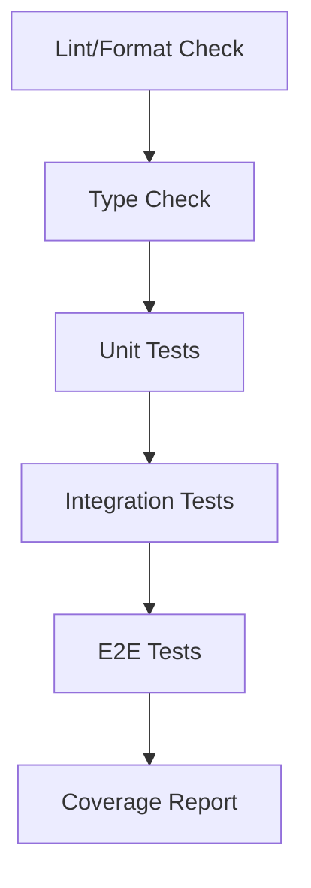

# テスト仕様書 - スライド依存関係管理システム

## 1. ドキュメント情報

| 項目       | 内容                                      |
| ---------- | ----------------------------------------- |
| タスクID   | task-feat-slide-dependency-management-003 |
| バージョン | 1.0.0                                     |
| 作成日     | 2026-01-09                                |
| 作成者     | Claude (tdd-principles skill)             |

---

## 2. テスト戦略

### 2.1 テストピラミッド

```
                    ┌─────────────┐
                    │   E2E/UI    │ 10%
                    │   Tests     │
                    └─────────────┘
                  ┌─────────────────┐
                  │  Integration    │ 30%
                  │  Tests          │
                  └─────────────────┘
              ┌─────────────────────────┐
              │     Unit Tests          │ 60%
              │                         │
              └─────────────────────────┘
```

### 2.2 テストアプローチ

| アプローチ               | 適用範囲                     | 理由                        |
| ------------------------ | ---------------------------- | --------------------------- |
| TDD (Red-Green-Refactor) | ドメインロジック、サービス層 | 仕様の明確化、設計品質向上  |
| BDD (Given-When-Then)    | 受け入れテスト、統合テスト   | ビジネス要件との整合性確保  |
| Contract Testing         | IPC通信層                    | Main/Renderer間の整合性保証 |
| Property-Based Testing   | ハッシュ計算、パス検証       | エッジケースの網羅          |

---

## 3. テスト環境

### 3.1 テストフレームワーク

| 用途             | ツール                 | 理由                         |
| ---------------- | ---------------------- | ---------------------------- |
| ユニットテスト   | Vitest                 | 高速、ESM対応、型安全        |
| UIコンポーネント | @testing-library/react | ユーザー中心のテスト         |
| E2Eテスト        | Playwright             | クロスブラウザ、Electron対応 |
| モック           | vitest.mock / vi.fn    | ネイティブサポート           |
| カバレッジ       | c8 (Vitest内蔵)        | Vitest統合                   |

### 3.2 テスト対象別設定

```typescript
// vitest.config.ts
import { defineConfig } from "vitest/config";

export default defineConfig({
  test: {
    globals: true,
    environment: "node", // Main Process
    include: ["src/**/*.test.ts"],
    coverage: {
      provider: "c8",
      reporter: ["text", "html", "lcov"],
      thresholds: {
        lines: 80,
        branches: 60,
        functions: 80,
        statements: 80,
      },
    },
  },
});
```

```typescript
// vitest.config.renderer.ts
import { defineConfig } from "vitest/config";

export default defineConfig({
  test: {
    globals: true,
    environment: "jsdom", // Renderer Process
    setupFiles: ["./src/test/setup.ts"],
    include: ["src/renderer/**/*.test.{ts,tsx}"],
  },
});
```

---

## 4. テスト分類

### 4.1 ユニットテスト対象

| モジュール              | ファイル                         | 優先度 | カバレッジ目標 |
| ----------------------- | -------------------------------- | ------ | -------------- |
| slide-project.ts        | packages/shared/src/slide/       | High   | 90%            |
| dependency-manager.ts   | packages/shared/src/slide/       | High   | 90%            |
| file-watcher.ts         | apps/desktop/src/main/slide/     | High   | 85%            |
| skill-executor.ts       | apps/desktop/src/main/slide/     | High   | 85%            |
| sync-manager.ts         | apps/desktop/src/main/slide/     | Medium | 80%            |
| slideProjectStore.ts    | apps/desktop/src/renderer/slide/ | High   | 85%            |
| SyncStatusIndicator.tsx | apps/desktop/src/renderer/slide/ | Medium | 80%            |
| SkillPhasePanel.tsx     | apps/desktop/src/renderer/slide/ | Medium | 80%            |

### 4.2 統合テスト対象

| テストシナリオ      | 検証範囲                             | 優先度 |
| ------------------- | ------------------------------------ | ------ |
| IPC通信フロー       | Renderer → Preload → Main → Response | High   |
| ファイル変更→UI更新 | FileWatcher → IPC → Store → UI       | High   |
| スキル実行→結果反映 | UI → IPC → SkillExecutor → UI        | High   |
| エラーハンドリング  | 各層でのエラー伝播                   | Medium |
| 無限ループ防止      | FileWatcher changeContextMap         | High   |

### 4.3 E2Eテスト対象

| シナリオ                  | 検証内容             | 優先度 |
| ------------------------- | -------------------- | ------ |
| プロジェクト起動→監視開始 | アプリ全体のフロー   | High   |
| structure.md編集→自動同期 | ユーザーワークフロー | High   |
| スキル実行→結果確認       | ユーザー操作の完結性 | Medium |

---

## 5. モック・スタブ戦略

### 5.1 モック対象

| 依存先           | モック方法                   | 理由                       |
| ---------------- | ---------------------------- | -------------------------- |
| chokidar         | Manual Mock + EventEmitter   | ファイルシステム依存を排除 |
| Claude Agent SDK | vi.mock + Promise.resolve    | 外部API依存を排除          |
| File System      | memfs / vitest mock          | I/O依存を排除              |
| Electron IPC     | vi.fn() + イベントエミッター | プロセス間通信を模擬       |

### 5.2 モック実装例

```typescript
// __mocks__/chokidar.ts
import { EventEmitter } from "events";

class MockWatcher extends EventEmitter {
  close = vi.fn();
}

export const watch = vi.fn(() => new MockWatcher());

// テスト内での使用
vi.mock("chokidar");
const mockWatcher = new MockWatcher();
vi.mocked(watch).mockReturnValue(mockWatcher);

// ファイル変更をシミュレート
mockWatcher.emit("change", "/path/to/structure.md");
```

```typescript
// __mocks__/electron-ipc.ts
export const mockIpcRenderer = {
  invoke: vi.fn(),
  on: vi.fn((channel, callback) => {
    // イベントハンドラを保存
    return () => {};
  }),
  removeListener: vi.fn(),
};

export const mockIpcMain = {
  handle: vi.fn(),
};
```

### 5.3 Test Double選択基準

| Double種類 | 使用場面                     | 例                       |
| ---------- | ---------------------------- | ------------------------ |
| Stub       | 固定値を返す依存             | getSyncStatus → "synced" |
| Mock       | 呼び出し検証が必要な依存     | ipcRenderer.invoke       |
| Spy        | 実装は使いつつ呼び出しを記録 | console.error            |
| Fake       | 簡易実装で代替               | memfs for File System    |

---

## 6. 非同期テスト戦略

### 6.1 待機戦略

| シナリオ           | 待機方法                                           |
| ------------------ | -------------------------------------------------- |
| イベント発火待ち   | `await new Promise(r => emitter.once('event', r))` |
| 状態変更待ち       | `waitFor(() => expect(state).toBe(...))`           |
| デバウンス完了待ち | `vi.advanceTimersByTime(500)`                      |
| 非同期処理完了待ち | `await act(async () => {...})`                     |

### 6.2 タイマー制御

```typescript
describe("debounce tests", () => {
  beforeEach(() => {
    vi.useFakeTimers();
  });

  afterEach(() => {
    vi.useRealTimers();
  });

  it("should debounce file changes", async () => {
    const callback = vi.fn();
    watcher.onStructureChange(callback);

    // 連続変更をシミュレート
    watcher.handleChange("/path/structure.md");
    watcher.handleChange("/path/structure.md");
    watcher.handleChange("/path/structure.md");

    // デバウンス期間経過
    vi.advanceTimersByTime(500);

    expect(callback).toHaveBeenCalledTimes(1);
  });
});
```

### 6.3 Flaky Test防止策

| 問題           | 対策                                 |
| -------------- | ------------------------------------ |
| タイミング依存 | Fake Timers使用                      |
| 順序依存       | 各テストで状態リセット               |
| グローバル状態 | beforeEach/afterEachでクリーンアップ |
| 非同期リーク   | AbortControllerで確実にキャンセル    |

---

## 7. テスト実行計画

### 7.1 実行順序



### 7.2 CI/CD統合

```yaml
# .github/workflows/test.yml
test:
  runs-on: ubuntu-latest
  steps:
    - name: Unit Tests
      run: pnpm test:unit
    - name: Integration Tests
      run: pnpm test:integration
    - name: Coverage Check
      run: pnpm test:coverage --fail-under=80
```

---

## 8. カバレッジ目標

### 8.1 ユニットテスト

| 指標               | 最低基準 | 推奨基準 | 達成時の判定 |
| ------------------ | -------- | -------- | ------------ |
| Line Coverage      | 80%      | 90%      | PASS         |
| Branch Coverage    | 60%      | 70%      | PASS         |
| Function Coverage  | 80%      | 90%      | PASS         |
| Statement Coverage | 80%      | 90%      | PASS         |

### 8.2 統合テスト

| カテゴリ     | 目標 | 達成時の判定 |
| ------------ | ---- | ------------ |
| IPC通信パス  | 100% | PASS         |
| データフロー | 100% | PASS         |
| エラーパス   | 80%+ | PASS         |
| 状態遷移     | 100% | PASS         |

---

## 9. テスト命名規則

### 9.1 ファイル命名

| 対象             | パターン                        | 例                             |
| ---------------- | ------------------------------- | ------------------------------ |
| ユニットテスト   | `{module}.test.ts`              | `file-watcher.test.ts`         |
| 統合テスト       | `{feature}.integration.test.ts` | `slide.integration.test.ts`    |
| UIコンポーネント | `{Component}.test.tsx`          | `SyncStatusIndicator.test.tsx` |

### 9.2 テストケース命名

```typescript
// should + 期待動作
it("should emit structureChange event when structure.md is modified");

// 条件 + 期待動作
it("returns synced status when files have matching hashes");

// BDD形式
it(
  "given out-of-sync state, when sync button clicked, then status becomes syncing",
);
```

---

## 10. 変更履歴

| バージョン | 日付       | 変更内容 |
| ---------- | ---------- | -------- |
| 1.0.0      | 2026-01-09 | 初版作成 |
